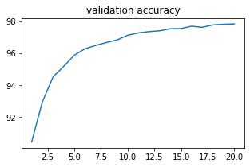

# 卷积神经网络实验报告

## 运行原始版本MLP

在实验给出的代码中，实现了一个非常简单的MLP，由三个全连接层构成，三个全连接层的参数如下

| 层数 | 输入维度 | 输出维度 |
| ---- | -------- | -------- |
| 1    | 28*28    | 100      |
| 2    | 100      | 80       |
| 3    | 80       | 10       |

每一个全连接层后面会经过一个激活函数，在前两个全连接层后使用的是ReLu函数，并且使用了0.2的dropout。在最后一个全连接层中，由于其结果将会作为输出，所以将其通过了log_softmax函数，得到样本属于每一个类别的概率。

模型的具体结构如下所示。

```plaintext
Net(
  (fc1): Linear(in_features=784, out_features=100, bias=True)
  (fc1_drop): Dropout(p=0.2, inplace=False)
  (fc2): Linear(in_features=100, out_features=80, bias=True)
  (fc2_drop): Dropout(p=0.2, inplace=False)
  (fc3): Linear(in_features=80, out_features=10, bias=True)
)
```

在实验中，训练使用的是MNIST手写数字识别的数据集，采用交叉熵损失函数，使用SGD作为优化器，学习率为0.01，方便起见，只训练了20个epoch，在验证集上的损失函数值和准确率如下图所示。




可以看到，经过20的epoch之后，在验证集上的效果已经收敛，并最终取得了

## 网络结构优化

为了进一步探究网络层数、隐藏层大小和优化器学习率对于最终实验结果的影响，在实验中分别尝试了MLP层数为1，3，5的情况，和隐藏层大小为[80,40,10]，[100,80,10]，[200,100,10]的配置，学习率设置为0.1，0.01和0.001。得到了结果如图所示。

### 网络层数影响

首先对比了不同的MLP层数对最终实验结果的影响，对所有的网络都训练了20个epoch，得到实验结果如下


从实验结果可以看出，单层的MLP拟合能力有限，并不能够随着训练的epoch增加进一步提升性能。3层和5层的MLP都能够得到很好的预测结果，并且两者并没有什么明显的差异。因此可以看出，MLP的层数更多能够起到提升效果的作用，但是当MLP的层数和任务的复杂度相匹配之后，再提升MLP的层数并不能够取得性能收益。并且从图中可以看出，3层的MLP的性能要略高于5层MLP，说明MLP的层数过多，可能会导致梯度回传的过程中最后几层出现梯度消失的问题，进而影响模型的训练结果。

### 隐藏层宽度影响

然后还对比了不同的隐藏层大小，为了保证实验的公平，都采用3层的MLP进行比较。得到实验结果如下。


从实验结果中可以看出，逐渐增加隐藏层的宽度有利于提升网络性能，这是用于隐藏层的宽度增加，能够表示更多的特征，也就可以让不同的类别在隐藏层的中间表示中能够具有更强的辨识度，进而对于最终的分类结果能够进行提升。

### 学习率影响

然后还对比了不同的隐藏层大小，为了保证实验的公平，都采用3层的MLP进行比较。得到实验结果如下。


从学习率的变化来看，学习率为0.1和0.01对于一般的训练来说都是比较大的学习率，此时可以看出模型很快就能够收敛。并且由于训练任务相对比较简单，优化器即使使用了较大的学习率仍能够找到较优解，而不会因为学习率过大导致不能够收敛到最优点。而当学习率为0.001的时候，对于本任务而言学习率相对较小，可以看出模型的收敛速度明显放慢，并且到训练后期的时候，模型的准确率不能够很好提升，这是因为使用较小的学习率可能使得模型陷入局部最优解而无法跳出。

## Vision Permutator复现

Vision Permutator是一种使用MLP来实现和Vision Transformer同样效果的方式。ViP首先将输入的图像按照行列打成多个patch，然后将每个patch都进行embedding，随后分别在行方向，列方向和通道方向上做MLP，这样就使得抽取到的特征即融合了行列之间的空间关系，由包含有通道之间的特征。最后将三个方向的特征加和然后对patch之间求平均值，作为最后进行分类的特征。其结构图如下，引自原始论文。


本次实验中使用的模型结构打印如下

```
Vip(
  (embedding): Conv2d(1, 336, kernel_size=(2, 2), stride=(2, 2))
  (encoder): ModuleList(
    (0): PermutatorBlock(
      (norm1): LayerNorm((336,), eps=1e-05, elementwise_affine=True)
      (vip_block): WeightedMLP(
        (mlp_c): Linear(in_features=336, out_features=336, bias=False)
        (mlp_h): Linear(in_features=336, out_features=336, bias=False)
        (mlp_w): Linear(in_features=336, out_features=336, bias=False)
        (reweight): Sequential(
          (0): Linear(in_features=336, out_features=84, bias=True)
          (1): ReLU()
          (2): Linear(in_features=84, out_features=1008, bias=True)
        )
        (out_proj): Linear(in_features=336, out_features=336, bias=True)
        (drop): Dropout(p=0.7, inplace=False)
      )
      (norm2): LayerNorm((336,), eps=1e-05, elementwise_affine=True)
      (mlp): Sequential(
        (0): Linear(in_features=336, out_features=1344, bias=True)
        (1): ReLU()
        (2): Linear(in_features=1344, out_features=336, bias=True)
      )
    )
    (1): PermutatorBlock(
      (norm1): LayerNorm((336,), eps=1e-05, elementwise_affine=True)
      (vip_block): WeightedMLP(
        (mlp_c): Linear(in_features=336, out_features=336, bias=False)
        (mlp_h): Linear(in_features=336, out_features=336, bias=False)
        (mlp_w): Linear(in_features=336, out_features=336, bias=False)
        (reweight): Sequential(
          (0): Linear(in_features=336, out_features=84, bias=True)
          (1): ReLU()
          (2): Linear(in_features=84, out_features=1008, bias=True)
        )
        (out_proj): Linear(in_features=336, out_features=336, bias=True)
        (drop): Dropout(p=0.7, inplace=False)
      )
      (norm2): LayerNorm((336,), eps=1e-05, elementwise_affine=True)
      (mlp): Sequential(
        (0): Linear(in_features=336, out_features=1344, bias=True)
        (1): ReLU()
        (2): Linear(in_features=1344, out_features=336, bias=True)
      )
    )
    (2): PermutatorBlock(
      (norm1): LayerNorm((336,), eps=1e-05, elementwise_affine=True)
      (vip_block): WeightedMLP(
        (mlp_c): Linear(in_features=336, out_features=336, bias=False)
        (mlp_h): Linear(in_features=336, out_features=336, bias=False)
        (mlp_w): Linear(in_features=336, out_features=336, bias=False)
        (reweight): Sequential(
          (0): Linear(in_features=336, out_features=84, bias=True)
          (1): ReLU()
          (2): Linear(in_features=84, out_features=1008, bias=True)
        )
        (out_proj): Linear(in_features=336, out_features=336, bias=True)
        (drop): Dropout(p=0.7, inplace=False)
      )
      (norm2): LayerNorm((336,), eps=1e-05, elementwise_affine=True)
      (mlp): Sequential(
        (0): Linear(in_features=336, out_features=1344, bias=True)
        (1): ReLU()
        (2): Linear(in_features=1344, out_features=336, bias=True)
      )
    )
    (3): PermutatorBlock(
      (norm1): LayerNorm((336,), eps=1e-05, elementwise_affine=True)
      (vip_block): WeightedMLP(
        (mlp_c): Linear(in_features=336, out_features=336, bias=False)
        (mlp_h): Linear(in_features=336, out_features=336, bias=False)
        (mlp_w): Linear(in_features=336, out_features=336, bias=False)
        (reweight): Sequential(
          (0): Linear(in_features=336, out_features=84, bias=True)
          (1): ReLU()
          (2): Linear(in_features=84, out_features=1008, bias=True)
        )
        (out_proj): Linear(in_features=336, out_features=336, bias=True)
        (drop): Dropout(p=0.7, inplace=False)
      )
      (norm2): LayerNorm((336,), eps=1e-05, elementwise_affine=True)
      (mlp): Sequential(
        (0): Linear(in_features=336, out_features=1344, bias=True)
        (1): ReLU()
        (2): Linear(in_features=1344, out_features=336, bias=True)
      )
    )
    (4): PermutatorBlock(
      (norm1): LayerNorm((336,), eps=1e-05, elementwise_affine=True)
      (vip_block): WeightedMLP(
        (mlp_c): Linear(in_features=336, out_features=336, bias=False)
        (mlp_h): Linear(in_features=336, out_features=336, bias=False)
        (mlp_w): Linear(in_features=336, out_features=336, bias=False)
        (reweight): Sequential(
          (0): Linear(in_features=336, out_features=84, bias=True)
          (1): ReLU()
          (2): Linear(in_features=84, out_features=1008, bias=True)
        )
        (out_proj): Linear(in_features=336, out_features=336, bias=True)
        (drop): Dropout(p=0.7, inplace=False)
      )
      (norm2): LayerNorm((336,), eps=1e-05, elementwise_affine=True)
      (mlp): Sequential(
        (0): Linear(in_features=336, out_features=1344, bias=True)
        (1): ReLU()
        (2): Linear(in_features=1344, out_features=336, bias=True)
      )
    )
    (5): PermutatorBlock(
      (norm1): LayerNorm((336,), eps=1e-05, elementwise_affine=True)
      (vip_block): WeightedMLP(
        (mlp_c): Linear(in_features=336, out_features=336, bias=False)
        (mlp_h): Linear(in_features=336, out_features=336, bias=False)
        (mlp_w): Linear(in_features=336, out_features=336, bias=False)
        (reweight): Sequential(
          (0): Linear(in_features=336, out_features=84, bias=True)
          (1): ReLU()
          (2): Linear(in_features=84, out_features=1008, bias=True)
        )
        (out_proj): Linear(in_features=336, out_features=336, bias=True)
        (drop): Dropout(p=0.7, inplace=False)
      )
      (norm2): LayerNorm((336,), eps=1e-05, elementwise_affine=True)
      (mlp): Sequential(
        (0): Linear(in_features=336, out_features=1344, bias=True)
        (1): ReLU()
        (2): Linear(in_features=1344, out_features=336, bias=True)
      )
    )
  )
  (norm): LayerNorm((336,), eps=1e-05, elementwise_affine=True)
  (head): Linear(in_features=336, out_features=10, bias=True)
)
```

在我们的实验中，为了尽可能保证实验的公平性，和最终结果的有效性，我们只实现了简单的6层的ViP，然后patch的大小设置为2。得到实验结果如下。


从训练上来看，两者的性能差异不大，但是由于VIP有更大的参数量，并且其需要分为行、列和通道三种进行计算，所以相对MLP而言计算量要大很多，因此收敛的速度相对更慢，并且训练一个epoch所需要的时间会更长。
