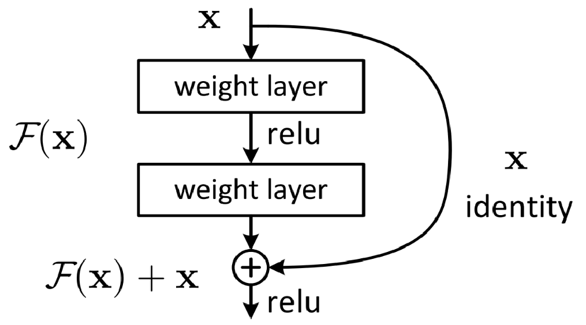
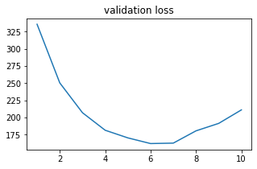
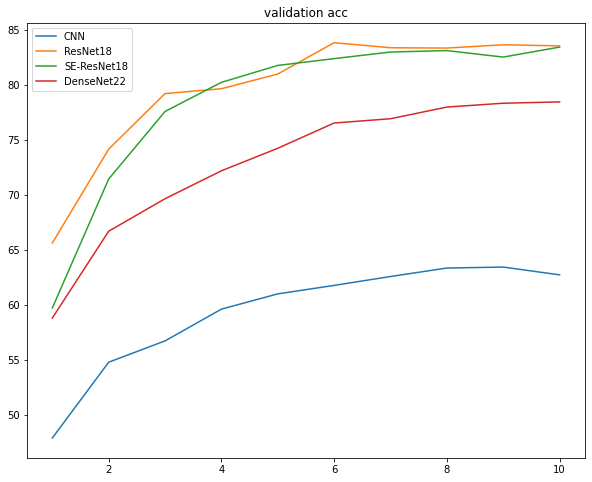

# 卷积神经网络实验报告

## 原始版本CNN网络

实验中给出的CNN网络结构十分简单，整体来说由两个卷积层和三个全连接层构成。输入的图像维度为[3,32,32]，首先通过第一个卷积层(Conv2d(3,6,5))，得到特征图大小为[6,28,28]，然后通过ReLu激活函数，在使用最大池化层进行下采样，得到特征图大小为[6,14,14]。然后通过第二个卷积层(Conv2d(6,16,5))，得到特征图大小为[16,10,10]，然后再通过最大池化层进行下采样，得到特征图[16,5,5]，将得到的特征展平得到一维向量，然后通过三个全连接层，参数分别为[400, 120],[120, 84],[84, 10]。具体网络结构如下。

```
Net(
  (conv1): Conv2d(3, 6, kernel_size=(5, 5), stride=(1, 1))
  (pool): MaxPool2d(kernel_size=2, stride=2, padding=0, dilation=1, ceil_mode=False)
  (conv2): Conv2d(6, 16, kernel_size=(5, 5), stride=(1, 1))
  (fc1): Linear(in_features=400, out_features=120, bias=True)
  (fc2): Linear(in_features=120, out_features=84, bias=True)
  (fc3): Linear(in_features=84, out_features=10, bias=True)
)
```

在本次实验中，选用Adam作为优化器，学习率为0.001，训练了10个epoch，得到训练结果如图。


可以看到，仅仅是两层的卷积神经网络和层的全连接网络结构，在训练了10个epoch左右，也能够接近收敛，并且尊重的准确率到了64%左右。虽然这个结果并不高，但是对于这样简单的网络结构和较少的训练论述而言，也算是不错的结果。

## ResNet实验

ResNet通过引入残差链接的方式，有效解决了模型层数过多的时候出现梯度消失的问题。ResNet中基本块的结构如下。



对于层数较少的ResNet，一般直接采用BasicBlock，其中包含两个 $3 \times 3$ 卷积层，得到的输出结果和该block的输入相加，这就是残差链接。通过残差连接，能够保证该block在进行梯度回传的时候，有一项的值为1，不会出现梯度消失的现象，使得网络能够通过增加层数来提升性能。

在本次实验中，由于只是进行简单的十分类任务，因此并不需要较深的网络，在这里选择使用ResNet最少层数的版本ResNet18。ResNet18包含4层。每层中都有两个BasicBlock，每一层的通道数逐步翻倍，四层的通道数分别为[64, 128, 256, 512]。通过增加通道数，降低特征图的大小，提取到不同方面的特征。其结构见最后附录。

为了保证实验对比的公平性，我们使用Adam优化器，学习率为0.001，训练了10个epoch，得到实验结果如图所示。


从验证集的loss和准确率来看，ResNet的效果要明显优于之前的简单CNN结构，一方面是ResNet中使用了更深的网络层数和更大的隐藏层宽度，另一方面是ResNet中增加了残差链接，使得模型在训练的过程中参数能够得到更好地更新。由于ResNet中参数较多，对于本次实验的任务来讲很容易出现过拟合的现象，从实验结果中也能够看到一些过拟合的端倪。在训练的最后几个epoch中，训练集上的准确率还在提升，但是验证集上的准确率基本上已经稳定了，并且loss还有上升的趋势。

## DenseNet实验

DenseNet也是一种深层神经网络的结构，他具有缓解梯度消失，增强特征传播、鼓励特征复用和大幅减少参数数量等优点。相较于ResNet在不同的Layer之间采用残差链接的方式，DenseNet采用了一种更为激进的策略，就是将之前Layer的输出全部拼接到一起作为本层的输入，这样就能够尽最大可能利用各层的特征，同样每一层也都有从最后一层可以直接回传的梯度，可以有效的缓解梯度消失的问题。

DenseNet的结构如下。其中每一个基本块的结构和ResNet十分相似，Transition Layer(过渡层)：采用$1\times1$Conv和$2\times2$平均池化作为相邻Dense Block之间的转换层，减少feature map数和缩小feature map size，size指width*height。在相邻Dense Block中输出的feature map size是相同的，以便它们能够很容易的连接在一起。


然后为了保证实验对比的公平，在实验中实现了一个22层的DenseNet，其结构见最后附录。训练过程都是采用了Adam优化器，学习率为0.01，训练了10个epoch，得到训练结果如下。


可以看到在本次实验中，DenseNet的性能要弱于ResNet，其原因大概是DenseNet的设计更加适合较深层的网络，而本次实现的DenseNet22相对来讲网络层数较浅，这样在进行特征拼接的时候，前几层的特征表示也不够好，导致影响到了后续的特征表示。

## SE-ResNet实验

带有SE模块的ResNet主要是解决了ResNet中通道数很多，而通道中可能提取到了一些干扰的因素，因此需要采用一种机制来筛选通道中的有效信息。SE模块就是这样的一种门控机制，通过通道注意力的方式来过滤出通道之间哪些通道是更为重要的。

具体而言，其实现方法是首先通过全局平均池化来获取到每一个通道中的信息，然后根据此通过一个两层的MLP，在经过sigmod计算出每一个通道的重要性，并通过这种门控机制，筛选更为有效的通道。其结构如下。


在对ResNet18进行改进之后，得到了Se-ResNet18，其结构见最后的附录。然后为了保证实验对比的公平，我们都是采用了Adam优化器，学习率为0.01，训练了10个epoch，得到训练结果如下。




## 实验对比

在本次实验中，总共实现了基础CNN、ResNet18、SE-ResNet18和DenseNet22网络，并且在相同的实验设定下进行测试，在训练阶段，全部采用Adam优化器，学习率为0.01，训练10个epoch。得到对比结果如下。



从实验结果上可以看出，普通的CNN结构效果最差，这里主要原因是因为CNN网络的层数相对较浅，对于特征的表示能力比较弱。

在增加了增加了残差链接之后，实现的ResNet18结构效果实现了明显的提升，主要原因是ResNet18大大加深了网络的层数，通过更深层的网络提高特征抽取能力。并且残差链接有效降低了深层网络中梯度消失的影响。这样可以看到ResNet18的效果在所有实现的方法中是最好的。

而增加了SE模块的ResNet18并没有取得性能提升，笔者分析可能是因为增加了SE模块后网络的参数增加了，在相同的轮数下还没有能够达到一个比较好的性能。从实验图像中也能够看出ResNet18基本上已经呈现出收敛，而增加了SE模块后仍有上升趋势。SE模块主要是通过筛选有效通道，增强通道中有效信息的提出，过滤掉噪声影响，来提升深层神经网络中多通道的特征表达能力，进而实现特征抽取效果的提升。

而DenseNet22并没有表现出其应有的优秀效果，笔者通过阅读论文发现，DenseNet适合更深层的网络结构，而在本次实验中实现的22层相对比较浅，DenseNet结构并不能很好地发挥作用。主要是因为DenseNet采用了更为激进的特征融合方式，后面的层会拼接前面层的输出，这就要求每一层的输出都要尽可能好，而较浅地网络层数会导致前面的层抽取的特征效果不加，进而影响了后续层的特征表示，因此影响了模型最终的性能。

## 附录

### ResNet18结构

```
ResNet_18(
  (conv1): Sequential(
    (0): Conv2d(3, 64, kernel_size=(3, 3), stride=(1, 1), padding=(1, 1), bias=False)
    (1): BatchNorm2d(64, eps=1e-05, momentum=0.1, affine=True, track_running_stats=True)
    (2): ReLU()
  )
  (layer1): Sequential(
    (0): BasicBlock(
      (left): Sequential(
        (0): Conv2d(64, 64, kernel_size=(3, 3), stride=(1, 1), padding=(1, 1), bias=False)
        (1): BatchNorm2d(64, eps=1e-05, momentum=0.1, affine=True, track_running_stats=True)
        (2): ReLU(inplace=True)
        (3): Conv2d(64, 64, kernel_size=(3, 3), stride=(1, 1), padding=(1, 1), bias=False)
        (4): BatchNorm2d(64, eps=1e-05, momentum=0.1, affine=True, track_running_stats=True)
      )
      (shortcut): Sequential()
    )
    (1): BasicBlock(
      (left): Sequential(
        (0): Conv2d(64, 64, kernel_size=(3, 3), stride=(1, 1), padding=(1, 1), bias=False)
        (1): BatchNorm2d(64, eps=1e-05, momentum=0.1, affine=True, track_running_stats=True)
        (2): ReLU(inplace=True)
        (3): Conv2d(64, 64, kernel_size=(3, 3), stride=(1, 1), padding=(1, 1), bias=False)
        (4): BatchNorm2d(64, eps=1e-05, momentum=0.1, affine=True, track_running_stats=True)
      )
      (shortcut): Sequential()
    )
  )
  (layer2): Sequential(
    (0): BasicBlock(
      (left): Sequential(
        (0): Conv2d(64, 128, kernel_size=(3, 3), stride=(2, 2), padding=(1, 1), bias=False)
        (1): BatchNorm2d(128, eps=1e-05, momentum=0.1, affine=True, track_running_stats=True)
        (2): ReLU(inplace=True)
        (3): Conv2d(128, 128, kernel_size=(3, 3), stride=(1, 1), padding=(1, 1), bias=False)
        (4): BatchNorm2d(128, eps=1e-05, momentum=0.1, affine=True, track_running_stats=True)
      )
      (shortcut): Sequential(
        (0): Conv2d(64, 128, kernel_size=(1, 1), stride=(2, 2), bias=False)
        (1): BatchNorm2d(128, eps=1e-05, momentum=0.1, affine=True, track_running_stats=True)
      )
    )
    (1): BasicBlock(
      (left): Sequential(
        (0): Conv2d(128, 128, kernel_size=(3, 3), stride=(1, 1), padding=(1, 1), bias=False)
        (1): BatchNorm2d(128, eps=1e-05, momentum=0.1, affine=True, track_running_stats=True)
        (2): ReLU(inplace=True)
        (3): Conv2d(128, 128, kernel_size=(3, 3), stride=(1, 1), padding=(1, 1), bias=False)
        (4): BatchNorm2d(128, eps=1e-05, momentum=0.1, affine=True, track_running_stats=True)
      )
      (shortcut): Sequential()
    )
  )
  (layer3): Sequential(
    (0): BasicBlock(
      (left): Sequential(
        (0): Conv2d(128, 256, kernel_size=(3, 3), stride=(2, 2), padding=(1, 1), bias=False)
        (1): BatchNorm2d(256, eps=1e-05, momentum=0.1, affine=True, track_running_stats=True)
        (2): ReLU(inplace=True)
        (3): Conv2d(256, 256, kernel_size=(3, 3), stride=(1, 1), padding=(1, 1), bias=False)
        (4): BatchNorm2d(256, eps=1e-05, momentum=0.1, affine=True, track_running_stats=True)
      )
      (shortcut): Sequential(
        (0): Conv2d(128, 256, kernel_size=(1, 1), stride=(2, 2), bias=False)
        (1): BatchNorm2d(256, eps=1e-05, momentum=0.1, affine=True, track_running_stats=True)
      )
    )
    (1): BasicBlock(
      (left): Sequential(
        (0): Conv2d(256, 256, kernel_size=(3, 3), stride=(1, 1), padding=(1, 1), bias=False)
        (1): BatchNorm2d(256, eps=1e-05, momentum=0.1, affine=True, track_running_stats=True)
        (2): ReLU(inplace=True)
        (3): Conv2d(256, 256, kernel_size=(3, 3), stride=(1, 1), padding=(1, 1), bias=False)
        (4): BatchNorm2d(256, eps=1e-05, momentum=0.1, affine=True, track_running_stats=True)
      )
      (shortcut): Sequential()
    )
  )
  (layer4): Sequential(
    (0): BasicBlock(
      (left): Sequential(
        (0): Conv2d(256, 512, kernel_size=(3, 3), stride=(2, 2), padding=(1, 1), bias=False)
        (1): BatchNorm2d(512, eps=1e-05, momentum=0.1, affine=True, track_running_stats=True)
        (2): ReLU(inplace=True)
        (3): Conv2d(512, 512, kernel_size=(3, 3), stride=(1, 1), padding=(1, 1), bias=False)
        (4): BatchNorm2d(512, eps=1e-05, momentum=0.1, affine=True, track_running_stats=True)
      )
      (shortcut): Sequential(
        (0): Conv2d(256, 512, kernel_size=(1, 1), stride=(2, 2), bias=False)
        (1): BatchNorm2d(512, eps=1e-05, momentum=0.1, affine=True, track_running_stats=True)
      )
    )
    (1): BasicBlock(
      (left): Sequential(
        (0): Conv2d(512, 512, kernel_size=(3, 3), stride=(1, 1), padding=(1, 1), bias=False)
        (1): BatchNorm2d(512, eps=1e-05, momentum=0.1, affine=True, track_running_stats=True)
        (2): ReLU(inplace=True)
        (3): Conv2d(512, 512, kernel_size=(3, 3), stride=(1, 1), padding=(1, 1), bias=False)
        (4): BatchNorm2d(512, eps=1e-05, momentum=0.1, affine=True, track_running_stats=True)
      )
      (shortcut): Sequential()
    )
  )
  (fc): Linear(in_features=512, out_features=10, bias=True)
)

```

### SE-ResNet18结构

```
SE_ResNet_18(
  (conv1): Sequential(
    (0): Conv2d(3, 64, kernel_size=(3, 3), stride=(1, 1), padding=(1, 1), bias=False)
    (1): BatchNorm2d(64, eps=1e-05, momentum=0.1, affine=True, track_running_stats=True)
    (2): ReLU()
  )
  (layer1): Sequential(
    (0): SEBasicBlock(
      (left): Sequential(
        (0): Conv2d(64, 64, kernel_size=(3, 3), stride=(1, 1), padding=(1, 1), bias=False)
        (1): BatchNorm2d(64, eps=1e-05, momentum=0.1, affine=True, track_running_stats=True)
        (2): ReLU(inplace=True)
        (3): Conv2d(64, 64, kernel_size=(3, 3), stride=(1, 1), padding=(1, 1), bias=False)
        (4): BatchNorm2d(64, eps=1e-05, momentum=0.1, affine=True, track_running_stats=True)
      )
      (shortcut): Sequential()
      (se): SEModule(
        (avg_pool): AdaptiveAvgPool2d(output_size=1)
        (fc1): Conv2d(64, 4, kernel_size=(1, 1), stride=(1, 1))
        (relu): ReLU(inplace=True)
        (fc2): Conv2d(4, 64, kernel_size=(1, 1), stride=(1, 1))
        (sigmoid): Sigmoid()
      )
    )
    (1): SEBasicBlock(
      (left): Sequential(
        (0): Conv2d(64, 64, kernel_size=(3, 3), stride=(1, 1), padding=(1, 1), bias=False)
        (1): BatchNorm2d(64, eps=1e-05, momentum=0.1, affine=True, track_running_stats=True)
        (2): ReLU(inplace=True)
        (3): Conv2d(64, 64, kernel_size=(3, 3), stride=(1, 1), padding=(1, 1), bias=False)
        (4): BatchNorm2d(64, eps=1e-05, momentum=0.1, affine=True, track_running_stats=True)
      )
      (shortcut): Sequential()
      (se): SEModule(
        (avg_pool): AdaptiveAvgPool2d(output_size=1)
        (fc1): Conv2d(64, 4, kernel_size=(1, 1), stride=(1, 1))
        (relu): ReLU(inplace=True)
        (fc2): Conv2d(4, 64, kernel_size=(1, 1), stride=(1, 1))
        (sigmoid): Sigmoid()
      )
    )
  )
  (layer2): Sequential(
    (0): SEBasicBlock(
      (left): Sequential(
        (0): Conv2d(64, 128, kernel_size=(3, 3), stride=(2, 2), padding=(1, 1), bias=False)
        (1): BatchNorm2d(128, eps=1e-05, momentum=0.1, affine=True, track_running_stats=True)
        (2): ReLU(inplace=True)
        (3): Conv2d(128, 128, kernel_size=(3, 3), stride=(1, 1), padding=(1, 1), bias=False)
        (4): BatchNorm2d(128, eps=1e-05, momentum=0.1, affine=True, track_running_stats=True)
      )
      (shortcut): Sequential(
        (0): Conv2d(64, 128, kernel_size=(1, 1), stride=(2, 2), bias=False)
        (1): BatchNorm2d(128, eps=1e-05, momentum=0.1, affine=True, track_running_stats=True)
      )
      (se): SEModule(
        (avg_pool): AdaptiveAvgPool2d(output_size=1)
        (fc1): Conv2d(128, 8, kernel_size=(1, 1), stride=(1, 1))
        (relu): ReLU(inplace=True)
        (fc2): Conv2d(8, 128, kernel_size=(1, 1), stride=(1, 1))
        (sigmoid): Sigmoid()
      )
    )
    (1): SEBasicBlock(
      (left): Sequential(
        (0): Conv2d(128, 128, kernel_size=(3, 3), stride=(1, 1), padding=(1, 1), bias=False)
        (1): BatchNorm2d(128, eps=1e-05, momentum=0.1, affine=True, track_running_stats=True)
        (2): ReLU(inplace=True)
        (3): Conv2d(128, 128, kernel_size=(3, 3), stride=(1, 1), padding=(1, 1), bias=False)
        (4): BatchNorm2d(128, eps=1e-05, momentum=0.1, affine=True, track_running_stats=True)
      )
      (shortcut): Sequential()
      (se): SEModule(
        (avg_pool): AdaptiveAvgPool2d(output_size=1)
        (fc1): Conv2d(128, 8, kernel_size=(1, 1), stride=(1, 1))
        (relu): ReLU(inplace=True)
        (fc2): Conv2d(8, 128, kernel_size=(1, 1), stride=(1, 1))
        (sigmoid): Sigmoid()
      )
    )
  )
  (layer3): Sequential(
    (0): SEBasicBlock(
      (left): Sequential(
        (0): Conv2d(128, 256, kernel_size=(3, 3), stride=(2, 2), padding=(1, 1), bias=False)
        (1): BatchNorm2d(256, eps=1e-05, momentum=0.1, affine=True, track_running_stats=True)
        (2): ReLU(inplace=True)
        (3): Conv2d(256, 256, kernel_size=(3, 3), stride=(1, 1), padding=(1, 1), bias=False)
        (4): BatchNorm2d(256, eps=1e-05, momentum=0.1, affine=True, track_running_stats=True)
      )
      (shortcut): Sequential(
        (0): Conv2d(128, 256, kernel_size=(1, 1), stride=(2, 2), bias=False)
        (1): BatchNorm2d(256, eps=1e-05, momentum=0.1, affine=True, track_running_stats=True)
      )
      (se): SEModule(
        (avg_pool): AdaptiveAvgPool2d(output_size=1)
        (fc1): Conv2d(256, 16, kernel_size=(1, 1), stride=(1, 1))
        (relu): ReLU(inplace=True)
        (fc2): Conv2d(16, 256, kernel_size=(1, 1), stride=(1, 1))
        (sigmoid): Sigmoid()
      )
    )
    (1): SEBasicBlock(
      (left): Sequential(
        (0): Conv2d(256, 256, kernel_size=(3, 3), stride=(1, 1), padding=(1, 1), bias=False)
        (1): BatchNorm2d(256, eps=1e-05, momentum=0.1, affine=True, track_running_stats=True)
        (2): ReLU(inplace=True)
        (3): Conv2d(256, 256, kernel_size=(3, 3), stride=(1, 1), padding=(1, 1), bias=False)
        (4): BatchNorm2d(256, eps=1e-05, momentum=0.1, affine=True, track_running_stats=True)
      )
      (shortcut): Sequential()
      (se): SEModule(
        (avg_pool): AdaptiveAvgPool2d(output_size=1)
        (fc1): Conv2d(256, 16, kernel_size=(1, 1), stride=(1, 1))
        (relu): ReLU(inplace=True)
        (fc2): Conv2d(16, 256, kernel_size=(1, 1), stride=(1, 1))
        (sigmoid): Sigmoid()
      )
    )
  )
  (layer4): Sequential(
    (0): SEBasicBlock(
      (left): Sequential(
        (0): Conv2d(256, 512, kernel_size=(3, 3), stride=(2, 2), padding=(1, 1), bias=False)
        (1): BatchNorm2d(512, eps=1e-05, momentum=0.1, affine=True, track_running_stats=True)
        (2): ReLU(inplace=True)
        (3): Conv2d(512, 512, kernel_size=(3, 3), stride=(1, 1), padding=(1, 1), bias=False)
        (4): BatchNorm2d(512, eps=1e-05, momentum=0.1, affine=True, track_running_stats=True)
      )
      (shortcut): Sequential(
        (0): Conv2d(256, 512, kernel_size=(1, 1), stride=(2, 2), bias=False)
        (1): BatchNorm2d(512, eps=1e-05, momentum=0.1, affine=True, track_running_stats=True)
      )
      (se): SEModule(
        (avg_pool): AdaptiveAvgPool2d(output_size=1)
        (fc1): Conv2d(512, 32, kernel_size=(1, 1), stride=(1, 1))
        (relu): ReLU(inplace=True)
        (fc2): Conv2d(32, 512, kernel_size=(1, 1), stride=(1, 1))
        (sigmoid): Sigmoid()
      )
    )
    (1): SEBasicBlock(
      (left): Sequential(
        (0): Conv2d(512, 512, kernel_size=(3, 3), stride=(1, 1), padding=(1, 1), bias=False)
        (1): BatchNorm2d(512, eps=1e-05, momentum=0.1, affine=True, track_running_stats=True)
        (2): ReLU(inplace=True)
        (3): Conv2d(512, 512, kernel_size=(3, 3), stride=(1, 1), padding=(1, 1), bias=False)
        (4): BatchNorm2d(512, eps=1e-05, momentum=0.1, affine=True, track_running_stats=True)
      )
      (shortcut): Sequential()
      (se): SEModule(
        (avg_pool): AdaptiveAvgPool2d(output_size=1)
        (fc1): Conv2d(512, 32, kernel_size=(1, 1), stride=(1, 1))
        (relu): ReLU(inplace=True)
        (fc2): Conv2d(32, 512, kernel_size=(1, 1), stride=(1, 1))
        (sigmoid): Sigmoid()
      )
    )
  )
  (fc): Linear(in_features=512, out_features=10, bias=True)
)

```

### DenseNet结构

```
DenseNet(
  (conv_1): Conv2d(3, 24, kernel_size=(3, 3), stride=(1, 1), padding=(1, 1), bias=False)
  (dense1): Sequential(
    (0): Bottleneck(
      (bn_1): BatchNorm2d(24, eps=1e-05, momentum=0.1, affine=True, track_running_stats=True)
      (conv_1): Conv2d(24, 48, kernel_size=(1, 1), stride=(1, 1), bias=False)
      (bn_2): BatchNorm2d(48, eps=1e-05, momentum=0.1, affine=True, track_running_stats=True)
      (conv_2): Conv2d(48, 12, kernel_size=(3, 3), stride=(1, 1), padding=(1, 1), bias=False)
    )
    (1): Bottleneck(
      (bn_1): BatchNorm2d(36, eps=1e-05, momentum=0.1, affine=True, track_running_stats=True)
      (conv_1): Conv2d(36, 48, kernel_size=(1, 1), stride=(1, 1), bias=False)
      (bn_2): BatchNorm2d(48, eps=1e-05, momentum=0.1, affine=True, track_running_stats=True)
      (conv_2): Conv2d(48, 12, kernel_size=(3, 3), stride=(1, 1), padding=(1, 1), bias=False)
    )
    (2): Bottleneck(
      (bn_1): BatchNorm2d(48, eps=1e-05, momentum=0.1, affine=True, track_running_stats=True)
      (conv_1): Conv2d(48, 48, kernel_size=(1, 1), stride=(1, 1), bias=False)
      (bn_2): BatchNorm2d(48, eps=1e-05, momentum=0.1, affine=True, track_running_stats=True)
      (conv_2): Conv2d(48, 12, kernel_size=(3, 3), stride=(1, 1), padding=(1, 1), bias=False)
    )
  )
  (trans_1): Transition(
    (bn): BatchNorm2d(60, eps=1e-05, momentum=0.1, affine=True, track_running_stats=True)
    (conv): Conv2d(60, 30, kernel_size=(1, 1), stride=(1, 1), bias=False)
  )
  (dense2): Sequential(
    (0): Bottleneck(
      (bn_1): BatchNorm2d(30, eps=1e-05, momentum=0.1, affine=True, track_running_stats=True)
      (conv_1): Conv2d(30, 48, kernel_size=(1, 1), stride=(1, 1), bias=False)
      (bn_2): BatchNorm2d(48, eps=1e-05, momentum=0.1, affine=True, track_running_stats=True)
      (conv_2): Conv2d(48, 12, kernel_size=(3, 3), stride=(1, 1), padding=(1, 1), bias=False)
    )
    (1): Bottleneck(
      (bn_1): BatchNorm2d(42, eps=1e-05, momentum=0.1, affine=True, track_running_stats=True)
      (conv_1): Conv2d(42, 48, kernel_size=(1, 1), stride=(1, 1), bias=False)
      (bn_2): BatchNorm2d(48, eps=1e-05, momentum=0.1, affine=True, track_running_stats=True)
      (conv_2): Conv2d(48, 12, kernel_size=(3, 3), stride=(1, 1), padding=(1, 1), bias=False)
    )
    (2): Bottleneck(
      (bn_1): BatchNorm2d(54, eps=1e-05, momentum=0.1, affine=True, track_running_stats=True)
      (conv_1): Conv2d(54, 48, kernel_size=(1, 1), stride=(1, 1), bias=False)
      (bn_2): BatchNorm2d(48, eps=1e-05, momentum=0.1, affine=True, track_running_stats=True)
      (conv_2): Conv2d(48, 12, kernel_size=(3, 3), stride=(1, 1), padding=(1, 1), bias=False)
    )
  )
  (trans_2): Transition(
    (bn): BatchNorm2d(66, eps=1e-05, momentum=0.1, affine=True, track_running_stats=True)
    (conv): Conv2d(66, 33, kernel_size=(1, 1), stride=(1, 1), bias=False)
  )
  (dense_3): Sequential(
    (0): Bottleneck(
      (bn_1): BatchNorm2d(33, eps=1e-05, momentum=0.1, affine=True, track_running_stats=True)
      (conv_1): Conv2d(33, 48, kernel_size=(1, 1), stride=(1, 1), bias=False)
      (bn_2): BatchNorm2d(48, eps=1e-05, momentum=0.1, affine=True, track_running_stats=True)
      (conv_2): Conv2d(48, 12, kernel_size=(3, 3), stride=(1, 1), padding=(1, 1), bias=False)
    )
    (1): Bottleneck(
      (bn_1): BatchNorm2d(45, eps=1e-05, momentum=0.1, affine=True, track_running_stats=True)
      (conv_1): Conv2d(45, 48, kernel_size=(1, 1), stride=(1, 1), bias=False)
      (bn_2): BatchNorm2d(48, eps=1e-05, momentum=0.1, affine=True, track_running_stats=True)
      (conv_2): Conv2d(48, 12, kernel_size=(3, 3), stride=(1, 1), padding=(1, 1), bias=False)
    )
    (2): Bottleneck(
      (bn_1): BatchNorm2d(57, eps=1e-05, momentum=0.1, affine=True, track_running_stats=True)
      (conv_1): Conv2d(57, 48, kernel_size=(1, 1), stride=(1, 1), bias=False)
      (bn_2): BatchNorm2d(48, eps=1e-05, momentum=0.1, affine=True, track_running_stats=True)
      (conv_2): Conv2d(48, 12, kernel_size=(3, 3), stride=(1, 1), padding=(1, 1), bias=False)
    )
  )
  (bn): BatchNorm2d(69, eps=1e-05, momentum=0.1, affine=True, track_running_stats=True)
  (fc): Linear(in_features=69, out_features=10, bias=True)
)
```

