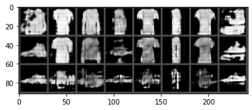
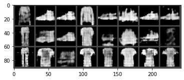

# 对抗神经网络实验报告

## 原始GAN网络实验

实验代码给出了一个简单的很简单的生成器和判别器，两个网络都是使用了两层全连接层来实现的。网络结构如下

```
Discriminator(
  (fc1): Linear(in_features=784, out_features=128, bias=True)
  (nonlin1): LeakyReLU(negative_slope=0.2)
  (fc2): Linear(in_features=128, out_features=1, bias=True)
)
Generator(
  (fc1): Linear(in_features=100, out_features=128, bias=True)
  (nonlin1): LeakyReLU(negative_slope=0.2)
  (fc2): Linear(in_features=128, out_features=784, bias=True)
)
```

为了更好使得生成器和判别器之间进行对抗训练，选用了Adam优化器，设置学习率为0.0002，训练了10个epoch，得到生成器和判别器的loss曲线如下。


## 使用卷积实现生成器和判别器

在本次实验中，为了方便起见，只实现了一个简单的两层卷积的生成器和判别器，但是根据以往GAN训练中前人总结的问题，做了以下调整。

1. 在判别器中，下采样不再使用指定的pooling方式，而是通过stride卷积的方式，使得模型自己学习该如何进行下采样。
2. 将ReLU激活函数换成Leaky ReLU
3. 最后生成器的输出层使用tanh作为激活函数

使用卷积实现的生成器和判别器的结构如下

```
CNNDiscriminator(
  (conv1): Conv2d(1, 64, kernel_size=(3, 3), stride=(1, 1), padding=(1, 1), bias=False)
  (conv2): Conv2d(64, 128, kernel_size=(3, 3), stride=(2, 2), padding=(1, 1), bias=False)
  (norm2): BatchNorm2d(128, eps=1e-05, momentum=0.1, affine=True, track_running_stats=True)
  (conv3): Conv2d(128, 128, kernel_size=(3, 3), stride=(1, 1), padding=(1, 1), bias=False)
  (norm3): BatchNorm2d(128, eps=1e-05, momentum=0.1, affine=True, track_running_stats=True)
  (fc): Linear(in_features=128, out_features=1, bias=True)
)
CNNGenerator(
  (fc1): Linear(in_features=100, out_features=6272, bias=True)
  (conv1): ConvTranspose2d(128, 128, kernel_size=(3, 3), stride=(1, 1), padding=(1, 1), bias=False)
  (norm1): BatchNorm2d(128, eps=1e-05, momentum=0.1, affine=True, track_running_stats=True)
  (conv2): ConvTranspose2d(128, 64, kernel_size=(4, 4), stride=(2, 2), padding=(1, 1), bias=False)
  (norm2): BatchNorm2d(64, eps=1e-05, momentum=0.1, affine=True, track_running_stats=True)
  (conv3): ConvTranspose2d(64, 1, kernel_size=(3, 3), stride=(1, 1), padding=(1, 1), bias=False)
)
```

为了更好使得生成器和判别器之间进行对抗训练，并且保证实验对比的公平性，同样选用了Adam优化器，设置学习率为0.0002，训练了10个epoch，得到生成器和判别器的loss曲线如下。


可以看到，经过了3个epoch之后，生成器和判别器都具有了一定的生成能力和判别能力，随后的epoch就是两个进行对抗训练的过程，因此两者的loss基本保持不变。

## 随机生成一组图片


## 调整随机数

在实验中，分别选择100维随机数的第20、50、60、70和90维，将其上下调整10，得到三组随机数，然后生成对应的图片。其中第一行是减小10的结果，第二行是原始结果，第三行是增加10的结果。


将第20维进行上下波动之后，可以发现，减小第20维的数值的时候，更倾向于生成裤子的图片，而增加第20维的数值的时候，更倾向于生成高跟鞋的图片，因此可以判断这一维度主要用来区分裤子和高跟鞋。



将第50维进行上下波动后，可以发现，减小第50维的数值的时候，更倾向于生成上衣的图片，而增加第50维的数值的时候，更倾向于生成皮鞋的图片，因此可以判断这一维度主要用来区分上衣和皮鞋。此外还能够看出，减小第50维的数值的时候，图像的亮度和清晰度会更高，说明第50维和生成上衣的关系十分密切。而增加第50维的数值的时候，图像的亮度和清晰度都降低，说明第50维虽然和皮鞋相关，但相关性并不高。



将第60维进行上下波动之后，可以发现，减小第60维的数值的时候，更倾向于生成鞋子的图片，而增加第60维的数值的时候，更倾向于生成连衣裙的图片，因此可以判断这一维度主要用来区分鞋子和连衣裙。


将第70维进行上下波动后，可以发现，减小第70维的数值的时候，更倾向于生成上衣的图片，而增加第70维的数值的时候，更倾向于生成裤子的图片，因此可以判断这一维度主要用来区分上衣和裤子。此外还能够看出，减小第70维的数值的时候，图像的亮度和清晰度会降低，说明第70维和生成上衣相关，但相关性并不高。而增加第70维的数值的时候，图像的亮度和清晰度提升，说明第70维虽然和皮鞋的关系十分密切。


将第90维进行上下波动后，可以发现，减小第90维的数值的时候，更倾向于生成上衣的图片，而增加第90维的数值的时候，更倾向于生成靴子的图片，因此可以判断这一维度主要用来区分上衣和靴子。

## 不同随机数调整对生成结果的影响

随机数中的向量可以认为是在图像特征空间中的一个点，向量中的每一维按理来说都包含了一些判别性的信息在其中。而如果调整了某一个维度的值，可能调整了某一判别性特征的值，导致图像在生成的过程中朝着摸一个类别靠近。

可以将这个问题反过来理解，判别器就是根据输入的图像，最终得到一个特征向量，然后将这个特征向量通过分类器进行分类，因此特征向量中的某些维度就是显式的表明了一些类别信息。而生成器则可以反过来认为输入的就是这个具有判别性的特征向量，根据其中每一维数据所指示的类型判别信息，生成对应类别的图片。
